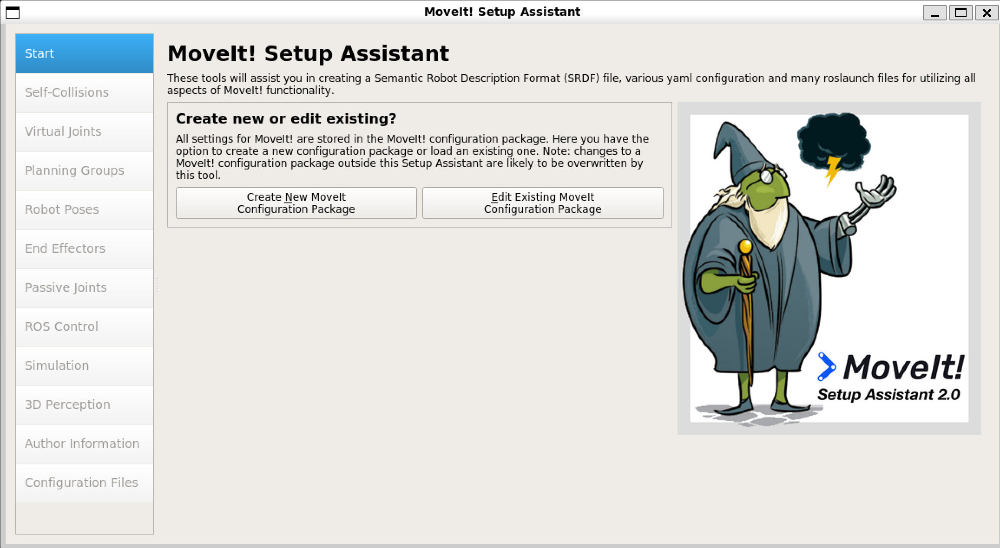

## Moveit

### move_group

- 控制信息输入 / 用户接口
    - C++/Python
    - Rviz
    - 其他方式
- 机器人配置信息输入 / ROS参数服务器
    - `URDF`：`move_group`查找并加载 `robot_description` 参数
    - `SRDF`：`move_group`查找并加载 `robot_description_semantic` 参数
    - 其他配置
        - 关节极限
        - 运动学计算
        - 运动规划
        - 3D 感知
        - 等
        - 配置信息在 `config` 文件夹下

- 运动学求解器
    - 正运动学求解器 `FK`
    - 雅可比函数
    - 逆运动学求解器 `IK`
        - 默认使用 `KDL` 库
        - 其他库
            - `TRACK-IK`
            - `IKFast`
            - 自定义算法插件

- 运动规划器 & 规划请求适配器
    - 默认使用 `OMPL`
        - 基于采样的规划算法
            - `PRM`
            - `RRT`
    - `Pilz` 工业运动规划器
    - `CHOMP`
    - `STOMP`
    - 作用：生成一条运动轨迹以抵达目标位姿
    - 运动学约束
        - 位置约束：限制 `link` 可到达的范围
        - 方向约束：`link` 的旋转角度限制
        - 可见性约束：设置某些 `link` 特征点在传感器范围内可见
        - 关节约束：关节限位
        - 自定义约束
    - 规划请求适配器
        - `FixStartStateBounds`：修复起始状态不在 `URDF` 指定的范围内
        - `FixWorkspaceBound`：为运动空间指定默认的工作空间，范围是 `10m x 10m x 10m` 的立方体
        - `FixStartStateCollision`：尝试通过微小的关节扰动值，在有碰撞的配置附近，对新的无碰撞配置进行采样，扰动值由 `jigle_fraction` 指定，含义是：关节总运动范围的百分比
        - `FixStartPathConstraints`：起始状态不符合指定的路径约束时，尝试在当前位置与符合约束的位置之间规划一条路径，并将新的位置作为路径规划的起始状态
        - `AddTimeParameterrization`：为规划的路径添加速度、加速度约束
        - `ResolveConstraintFrames`：使用子坐标系设置目标约束，可以将约束坐标系改为某个对象或机器人上的坐标系

- 规划场景
    - 表示周围的环境及机器人自身的状态
    - 规划场景监听器 `Planning Scene Monitor` 
        - `World Geometry Monitor`：外界环境监听器
        - `Scene Monitor`：场景监听器
        - `State Monitor`：状态监听器

- 碰撞检测
    - 使用 `FCL` 包实现
    - 检测目标
        - `Meshes`：模型文件定义的部分
        - `Primitive Shapes`：标准形状
        - `Octomap`：基于八叉树的占用地图，通过3D传感器构建
        - `ACM`：免检碰撞矩阵

- Moveit配置助手
    - `roslaunch moveit_setup_assistant setup_assistant.launch`
    
    - 加载 `urdf`
    - 设置 `ACM` 自碰撞矩阵
    - 添加虚拟关节：将机械臂的基坐标系与世界坐标系相连
    - 添加规划组
        - `Planning Group`：用于在语义上描述机器人的不同部分
        - 在进行逆运动学求解和运动规划时，是针对一个规划组进行
        - 机械臂抓取，可分为机械臂 `arm` 和夹爪 `gripper` 两部分
    - 添加位姿
    - 添加末端执行器 `effectors`
    - 添加被动关节：从动轮等
    - `ROS Control`：可以自动生成
    - 添加 `Gazebo` 仿真
    - 添加 3D 传感器
    - 作者信息
    - 生成配置文件
        - `config` 文件夹
        - `launch` 文件夹

### Moveit!功能包
- 配置文件 `config`
    - `SRDF`: `xarm.srdf`
        - 规划组信息
        - 预定义位姿
        - 虚拟关节配置
        - 碰撞矩阵配置
        - 末端执行器配置
    - `kinematics.yaml`
        - 运动学求解器及参数
        - 规划组名
    - `joint_limits.yaml`
        - 可以覆盖 `URDF` 中指定的关节动力学属性
    - `ompl_planning.yaml`
        - 运动规划库
        - `OMPL` 相关配置
    - `fake_controllers.yaml`
        - 执行规划出的轨迹，反馈实时关节状态

- 启动文件 `launch`
    - `demo.launch`
        - 设置启用数据、数据库路径、调试模式、fake虚拟控制器等参数
        - 启动fake控制器发布关节状态
        - 启动 `robot_state_publisher` 发布 `TF`
        - 启动 `move_group.launch`
        - 启动 `moveit_rviz.launch`
    - `move_group.launch`
        - 调试参数
        - `move_group` 配置参数
        - 启动 `planning_context.launch`
            - 加载 `URDF`
            - 加载 `SRDF`
            - 加载 `kinematics.yaml`
            - 加载 `joint_limits.yaml`
            - 加载 `cartesian_limits.yaml`
        - 启动 `planning_pipeline.launch.xml`
            - 加载 `ompl_planning_pipeline.launch.xml`
                - 加载 `ompl_planning.yaml`
        - 启动 `trajectory_execution.launch.xml`
            - 加载 `xarm_moveit_controller_manager.launch.xml`
                - 加载 `ros_controllers.yaml`
        - 启动 `sensor_manager.launch.xml`
            - 加载 `xarm_moveit_sensor_manager.launch.xml`
    - `setup_assistant.launch`：加载已经配置的数据，用于快速重新配置

### 控制真实机械臂

- `Moveit!` 与机械臂通信
- 规划轨迹并驱动机械臂执行
- 获取机械臂状态并发布到 `/joint_states`
- `Moveit!` 采用 `Action` 方式驱动机械臂
    - 默认为 `FollowJointTrajectoryAction`
    - 通常一个规划组对应一个 `Action`
    - 以 `<group_name>_controller/follow_joint_trajectory` 方式命名
    - `Action` 的 `goal`
        - `trajectory_msgs/JointTrajectory`：轨迹信息
        - `JointTolerance`
            - `path_tolerance`：轨迹公差，实际执行过程中轨迹超过公差范围，将停止
            - `goal_tolerance`：执行完毕后，关节位置停留在目标位置的公差范围内，才返回执行成功
            - `goal_time_tolerance`：在时刻：运动执行完成时间 + `goal_time_tolerance` 之前未完成目标运动，视为执行失败

- `xarm_moveit_planning_execution.launch`：启动真实机械臂
    - 删除 `joint_state_publisher` 节点，由真实机械臂负责状态发布 `/joint_states`

- 命令行使用：
    - `rosrun moveit_commander moveit_commander_cmdline.py` 启动命令行
    - `use <group_name>`
    - `current`
    - `go <goal_name>`
    - `go rand`
    - `plan <goal_name>`
    - `execute`
    - `record <name>`
    - `x=y`：没测试成功
